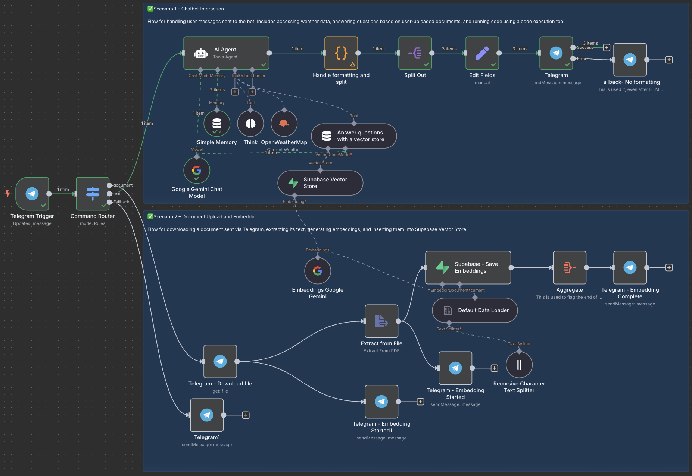

# 🤖 Telegram AI Assistant for Your Documents (n8n + Supabase + Gemini)

This project transforms a standard **Telegram bot** into your dedicated AI assistant – designed to understand and answer questions based on **your own documents**. It seamlessly integrates the power of **Google Gemini** for advanced language capabilities and **Supabase's vector database** for efficient, intelligent document retrieval. Built entirely within the no-code platform **n8n**, it allows you to deploy a sophisticated document chatbot without writing a single line of code.

Simply upload any PDF document to the bot, and instantly gain the ability to chat with it, querying its contents as if it were a knowledgeable expert on your uploaded files.

---

## ✨ Ignite Your Workflow: Use Cases

This project empowers two core interactions:

### 1. Conversational AI Interface (User Inquiry → Telegram Bot → Intelligent Answers)
- Users pose questions directly to the Telegram bot.
- The bot generates relevant, informative answers using the cutting-edge capabilities of the Google Gemini LLM.
- Leveraging a powerful vector search mechanism, it can pull specific, contextual information from previously uploaded documents to provide highly relevant and informed responses.
- (Optional) Augment answers with real-time data, like current **weather information**.

### 2. Effortless Document Integration (User Upload PDF → Processing → Searchable Knowledge)
- Users upload a PDF document directly to the bot.
- The workflow automatically parses the document content, converts it into numerical representations called embeddings using Gemini's embedding models.
- These embeddings, alongside the document's text content, are then securely stored in a dedicated **Supabase vector table**, creating a searchable knowledge base.
- Immediately after successful processing, the document becomes part of the bot's memory, enabling users to ask questions about its contents via the standard chat interface.

---
## 🧠 Core Intelligence Features

- ✅ **Pure No-Code**: Developed and managed entirely within the intuitive [n8n](https://n8n.io) automation platform.
- 📄 **Seamless PDF Integration**: Easily upload and process PDF documents to expand the bot's knowledge.
- 🧠 **Powered by Google Gemini**: Utilizes Gemini for both generating document embeddings and formulating intelligent conversational responses.
- 🗂 **Vector Database Memory (Supabase)**: Employs **Supabase as a robust vector database** for storing and efficiently searching document embeddings, providing the bot with long-term memory about your content.
- **⚡️ Rapid & Private Retrieval**: The vector search allows for swift identification and retrieval of the most relevant document snippets based on the user's query. This approach enhances response speed and significantly improves data privacy, as **the original document content remains securely stored in your Supabase instance, and only the user's query and the retrieved relevant chunks are sent to the LLM for generating a response.**
- 🧹 **Intelligent HTML Post-processing**: Cleans the LLM's responses by removing HTML tags not supported by Telegram while preserving essential formatting and correctly escaping special characters in the text content.
- 📤 **Adaptive Message Chunking**: Splits lengthy AI-generated answers into multiple messages that adhere to Telegram's 4096-character limit, ensuring the full response is delivered cleanly.
- 🌦️ **Dynamic Weather Data**: (Optional) Integrates with OpenWeatherMap to provide current weather information upon request.
- **📝 Note on Usage**: This workflow is designed primarily for **personal, single-user** scenarios. It processes each message independently and **does not include multi-user session management**, making it unsuitable for public deployment where different users require separate conversational contexts. For a session-based Telegram bot implemented in Python, you may refer to this project, which is a multi-model telegram bot: [https://github.com/mohamadghaffari/gemini-tel-bot](https://github.com/mohamadghaffari/gemini-tel-bot).
---

## 🛠 Getting Started: Setup

### 1. Obtain the Workflow

Clone or download this repository to get the necessary files:

- `telegram-pdf-ai-assistant.json`: The complete n8n workflow export.
- `README.md`: This guide.

### 2. Deploy the Workflow in n8n

- Access your local or hosted [n8n](https://n8n.io) instance.
- Navigate to `Workflows` → `Import from File` → select `telegram-pdf-ai-assistant.json`.

### 3. Connect Your Services: Configure Credentials

Create API credentials for the following services within your n8n instance:

| Service          | Purpose                          |
|------------------|------------------------------------|
| Telegram API     | Receiving user messages & sending replies |
| Google Gemini    | Generating embeddings & LLM responses |
| Supabase         | Storing & searching document vectors |
| OpenWeatherMap   | (Optional) Fetching weather data    |

### 4. Prepare Your Supabase Knowledge Base

Set up a vector-enabled table in your Supabase project to store your document embeddings. Execute the following SQL commands in your Supabase SQL Editor:

``` sql
-- Enable the pgvector extension to work with embedding vectors
create extension vector;

-- Create a table to store your documents and their embeddings
create table user_knowledge_base (
  id bigserial primary key,
  content text, -- Stores the text chunk from the document
  metadata jsonb, -- Stores document information (e.g., filename, page number)
  embedding vector(768) -- Stores the vector representation (embedding) generated by Gemini. Adjust dimension if using a different model.
);

-- Create a function to perform vector similarity search against your documents
create function match_documents (
  query_embedding vector(768),
  match_count int default null,
  filter jsonb DEFAULT '{}'
) returns table (
  id bigint,
  content text,
  metadata jsonb,
  similarity float
)
language plpgsql
as $$
#variable_conflict use_column
begin
  return query
  select
    id,
    content,
    metadata,
    -- Calculate cosine similarity: 1 - cosine distance (using the '<=>' operator provided by pgvector)
    1 - (user_knowledge_base.embedding <=> query_embedding) as similarity
  from user_knowledge_base
  where metadata @> filter -- Optional: filter results based on metadata
  order by user_knowledge_base.embedding <=> query_embedding -- Order by similarity (closest first)
  limit match_count; -- Limit the number of results
end;
$$;
````

This sets up the necessary table and a function to perform vector similarity searches, allowing you to find document chunks most similar to a user's query.

-----

## 💬 How it Works: The Interaction Flow

The process from a user's query to an intelligent answer is a seamless orchestration:

```
[User Sends Query via Telegram]
           ↓
[n8n Workflow Triggered]
           ↓
[User Query Processed] --> [Gemini Embeddings: Query is converted to a vector]
           ↓
[Supabase Vector Search: Find relevant document chunks based on query embedding]
           ↓
[n8n Combines: Original Query + Retrieved Document Chunks (Context)]
           ↓
[Google Gemini LLM: Generates Answer based on Query and Context]
           ↓
[n8n Post-processing: Cleans HTML formatting & Chunks Message for Telegram]
           ↓
[Telegram Bot Sends Answer Message(s)]
```

This flow leverages the **speed of vector search** in Supabase to quickly find pertinent information without needing to read entire documents. By sending only the user's query and the *most relevant* document chunks to Gemini, it **enhances data privacy** compared to solutions that might process full document contents with the LLM.

-----

## 🖼 Workflow Visual

A glimpse into the n8n workflow automation:


-----

## 📚 Integrated Technologies

This project brings together powerful tools:

  - [n8n](https://n8n.io) – The central hub for workflow automation and integration.
  - [Telegram Bot API](https://core.telegram.org/bots/api) – The communication layer for user interaction.
  - [Supabase](https://supabase.com/) + [pgvector Extension](https://www.google.com/search?q=https://supabase.com/docs/guides/ai/vector-embeddings) – Provides a scalable database with powerful vector search capabilities.
  - [Google Gemini API](https://ai.google.dev/) – The intelligence engine for embeddings and text generation.
  - [OpenWeatherMap API](https://openweathermap.org/api) – (Optional) For adding real-time weather features.

-----

## 📄 License

This project is released under the MIT License – feel free to use, modify, and distribute.

-----

## 🙌 Inspiration

This project was developed as part of an ongoing exploration into creating practical, intelligent AI agents using accessible no-code platforms and cutting-edge AI technologies.
